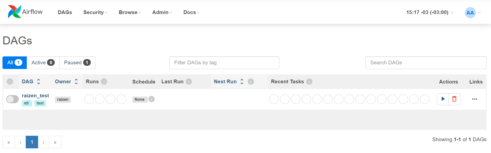
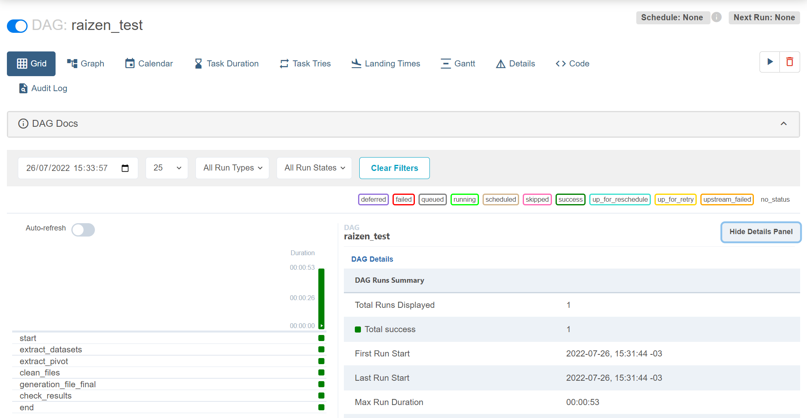

ANP Fuel Sales ETL Test
=======================
O objetivo deste teste é executar um pipeline ETL, desenvolvido especialmente para extrair PivotCache internos dos relatórios consolidados que foram [disponibilizados](http://www.anp.gov.br/dados-estatisticos) pela agência reguladora de petróleo/combustíveis do governo brasileiro, *ANP (Agência Nacional do Petróleo, Gás Natural e Biocombustíveis)*. 

<br>

## Cenários

Para resolução do problema serão apresentados dois cenários:
- O primeiro cenário utiliza container e orquestrador pipeline de dados.
- O segundo cenário utiliza uma biblioteca pywin32, que fornece acesso a muitas das APIs do Windows através do Python.

<br>

## **Cenário 01**
-----------------

Neste cenário utilizaremos o Docker que é um serviço de virtualização (contêineres), além do Airflow que é orquestrador de pipeline de dados.

## Instalação:
<br>

### Índice

  * [Requerimentos](#requerimentos)
  * [Instalação](#instalação)


Requerimentos
------------

Ferramentas requeridas para execução:

  * Docker
  * [docker-compose](docker-compose) 1.29.2

Instalação
------------

O Projeto poderá ser clonado utilizando o comando abaixo.

```bash
git clone https://github.com/andersdes/desafio_raizen.git
cd desafio_raizen/
```

Inicialização bem simples.

```bash
docker-compose up -d
```

Após a execução do comando será exibida a mesangem: 

```bash
Starting raizen_airflow_init      ... done
Starting raizen_airflow_scheduler ... done
Starting raizen_airflow_webserver ... done
Starting raizen_airflow_postgres  ... done
```

A mensagem acima informa que todos os serviços foram inicializados com sucesso.

No arquivo docker-compose.yaml é possível trocar todos os logins e senhas atribuidas aos serviços.

Para acesso ao Airflow foram atribuidas o login `airflow` e a senha `airflow`.


## Acessando a interface do Airflow

`http://localhost:8080`

login: `airflow`

senha: `airflow`


## Executando Dag



O pipeline desenvolvido irá realizar o download de arquivos necessários para análise. Todos os arquivos serão encontrados na pasta: **`./dags/dados/`**

- dataset_derivative.csv - Vendas de combustíveis derivados de petróleo por UF e produto
- dataset_diesel.csv - Vendas de diesel por UF e tipo
- vendas-combustiveis-m3.xlsx - Dados pivot

## Resultado


Após a execução da Dag será gerado um arquivo (**data_extracted.xlsx**) contendo 5 Sheets:

    - DERIVATIVES - Dataset (Vendas de combustíveis derivados de petróleo por UF e produto). 
    - DIESEL - Dataset (Vendas de diesel por UF e tipo).
    - DERIVATIVES_DISEL_FINAL - Dataset contendo os dados extraídos e transformados.
    - RESULT_DERIVATIVESxPIVOT - Checa se os totais extraído são iguais ao dos dados pivotado.
    - RESULT_DIESELxPIVOT - Checa se os totais extraído são iguais ao dos dados pivotado.

## Schema das Sheets (DERIVATIVES | DIESEL | DERIVATIVES_DISEL_FINAL)

O conteúdo dessas abas obedecem o formato abaixo:

| Column       | Type        |
| ------------ | ----------- |
| `year_month` | `date`      |
| `uf`         | `string`    |
| `product`    | `string`    |
| `unit`       | `string`    |
| `volume`     | `double`    |
| `created_at` | `timestamp` |

<br>

## **Cenário 02**
-----------------

<br>

 Este cenário foi criado no intuito de gerar os datasets utilizados no `Cenário 01`, caso não fossem disponibilizados no site do governo federal.

**O arquivo de referência que será utilizado é o [vendas-combustiveis-m3.xls](https://github.com/raizen-analytics/data-engineering-test/raw/master/assets/vendas-combustiveis-m3.xls).** 

Obs.: Esta biblioteca funciona apenas no **Windows**.

<br>

## Instalação:


### Índice

  * [Requerimentos](#requerimentos)
  * [Instalação](#instalação)


Requerimentos
------------

Ferramentas requeridas para execução:

  * Python >= 3
  * Pacote pywin32

Instalação
------------

```bash
pip install pywin32
```

## Executando script


O script irá percorrer o arquivo localizando as tabelas (Vendas de combustíveis derivados de petróleo por UF e produto | Vendas de diesel por UF e tipo), aplicando filtros consecultivos afim de extrair os dados nessários.

```bash
cd pywin32
python raizen_win32.py
```

Como o intuito é demonstrar uma alternativa para geração dos dataset, todos os arquivos serão encontrados na pasta: **`./pywin32/dados_win32/`**

- dataset_derivative.csv - Vendas de combustíveis derivados de petróleo por UF e produto
- dataset_diesel.csv - Vendas de diesel por UF e tipo
